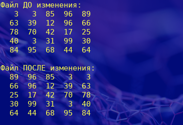

# Задача № 46
    Создать типизированный файл целочисленных массивов одинаковой
    размерности. Элементами массивов являются случайные числа.
    Преобразовать этот файл, поменяв порядок расположения элементов в
    массивах на обратный.

### Пример работы прораммы

